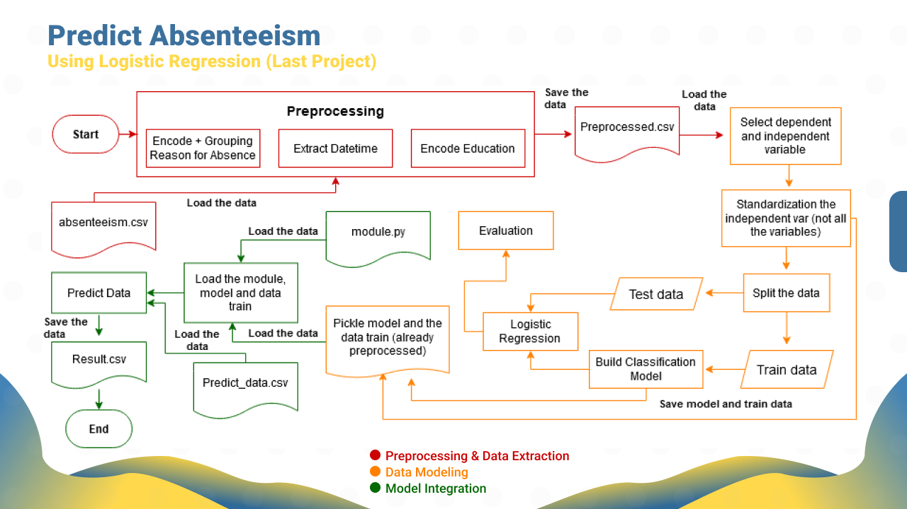

# Data Science Course 2020 (365 Careers - Udemy)

This repository contains my machine learning programs that I have learned from udemy (The Data Science Course 2020: Complete Data Science Bootcamp - 365 Careers). The machine learning is  a half from the whole part of this course. The subject from this course start from basic till expert such us probability, statistic (descriptive and inferential), basic python programming, Machine learning (Linear Regression, Logistic Regression, K-Means and Dendogram Clustering), Basic Neural Network + Tensor, model integration (module with pickel) and the last is make a dashboar using Tableu (Bonus course). Just check the code above to make you more understand about the machine larning flow. I also have made notes in each line of code, hope that can make you easier to understand the code.

**Machine Learning Program:**
<ol>
  <li>Single & Multiple Linear Regression Using Statsmodels</li>
  <li>Single & Multiple Linear Regression Using SKlearn</li>
  <li>Logistic & Binary Logistic Regression</li>
  <li>Kmeans & Dendogram Clustering</li>
  <li>Market Segmentation</li>
  <li>Introduction to Neural Network & Tensorflow</li>
  <li>Final Project (Machine Learning Integration)</li>
  <li>Certainly, real case project</li>
</ol>  

**Tebleu Link**
<ul>
  <li><a href="https://public.tableau.com/profile/mohamad.irwan.afandi#!/vizhome/Udemy2020result/TransportationExpenseandChildren">Final Project Analysis</a></li>
  <li><a href="https://public.tableau.com/profile/mohamad.irwan.afandi#!/vizhome/Udemybookreview/Dashboard1">Book Review</a></li>
</ul>

**Project Overview:**

